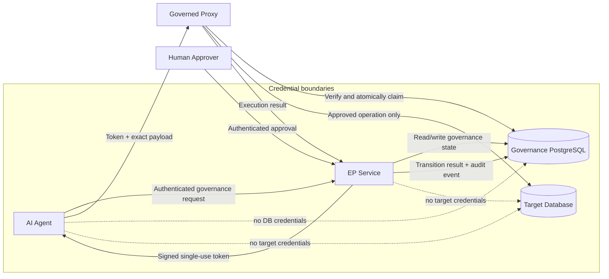
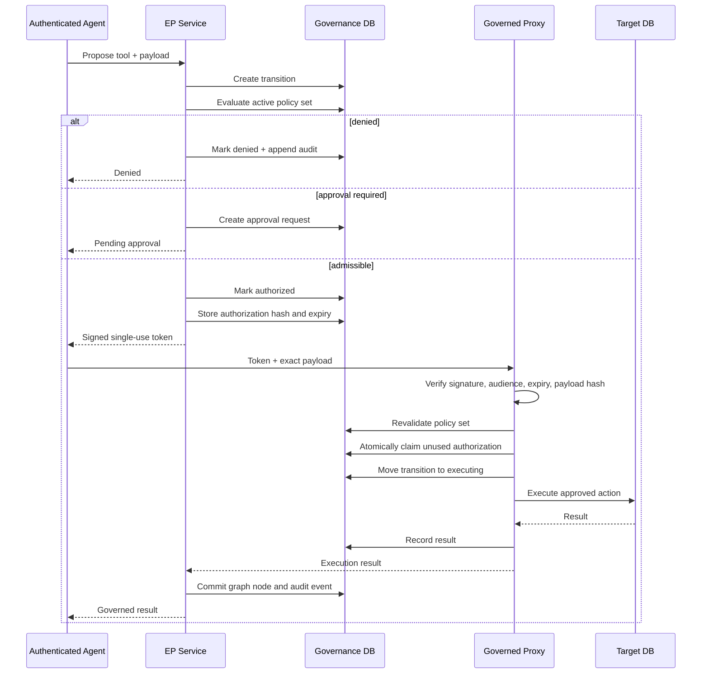
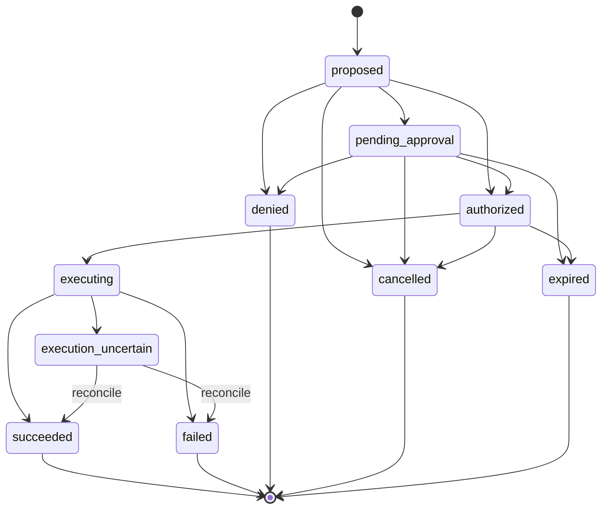
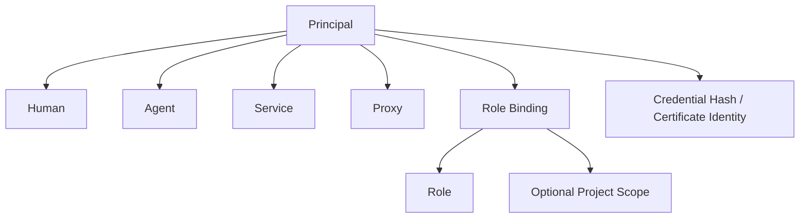
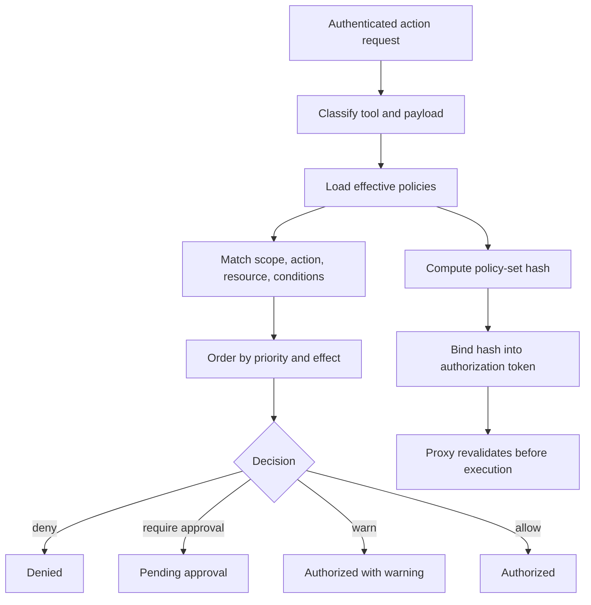
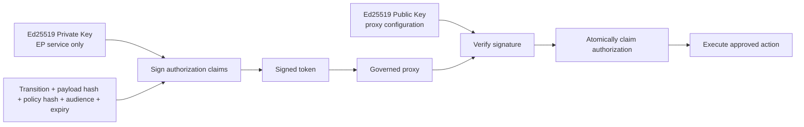
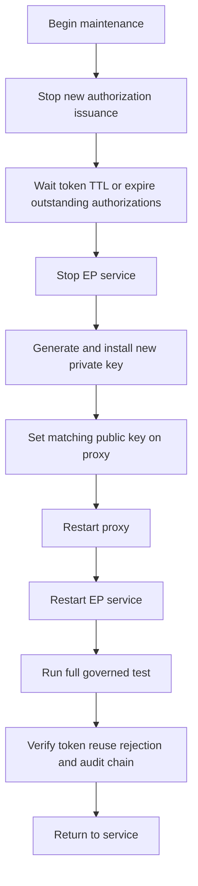
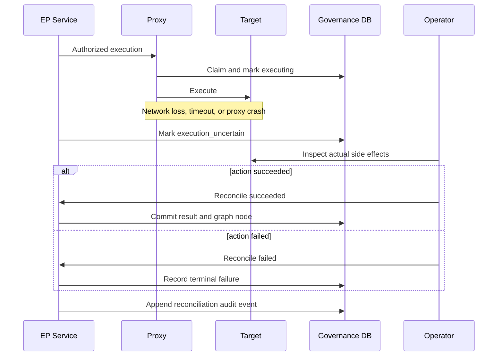
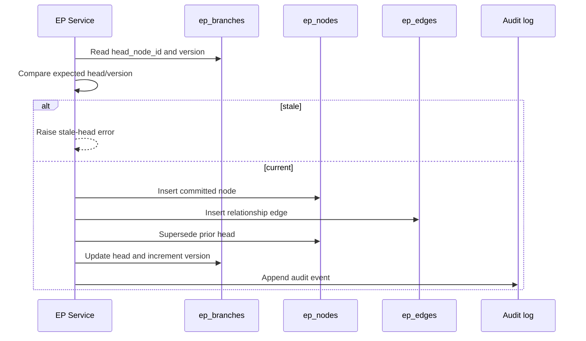
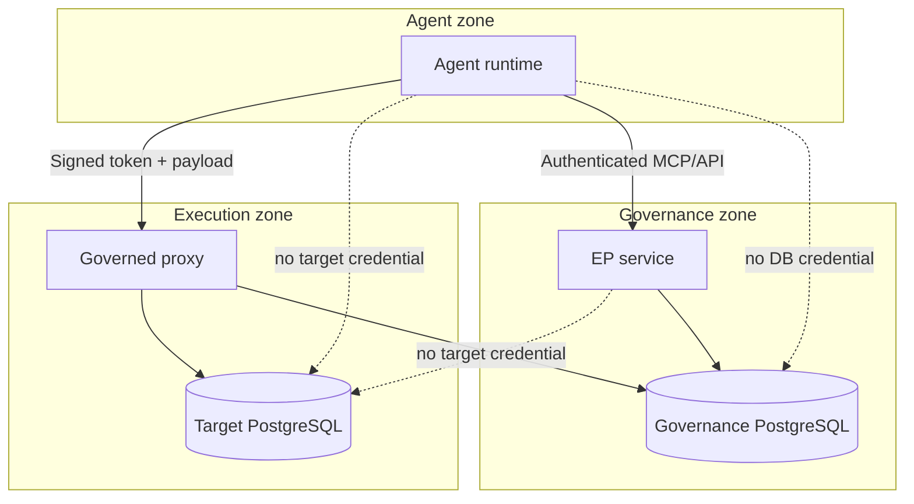

# EP-Governance Architecture Diagrams

**Status:** Draft visual companion to the architecture, deployment, operations, and database references.

---

## 1. System and trust boundaries

---

## 2. Authorization and execution sequence

---

## 3. Transition lifecycle

---

## 4. Identity and role model

---

## 5. Policy evaluation

---

## 6. Signing-key flow

The private key must never be available to the proxy or an agent.

---

## 7. Immediate key rotation

---

## 8. Execution uncertainty and reconciliation

---

## 9. Branch commit and optimistic concurrency

---

## 10. Deployment topology

---

## 11. Documentation placement

Recommended links:

- `README.md` → system and trust-boundary diagram;
- `docs/architecture.md` → system, identity, policy, and branch diagrams;
- `docs/getting-started.md` → authorization sequence;
- `docs/deployment/enforced-mode.md` → deployment and key-flow diagrams;
- `docs/operations/runbooks.md` → key rotation and reconciliation diagrams;
- `docs/reference/database-schema.md` → ER and audit-chain diagrams.
