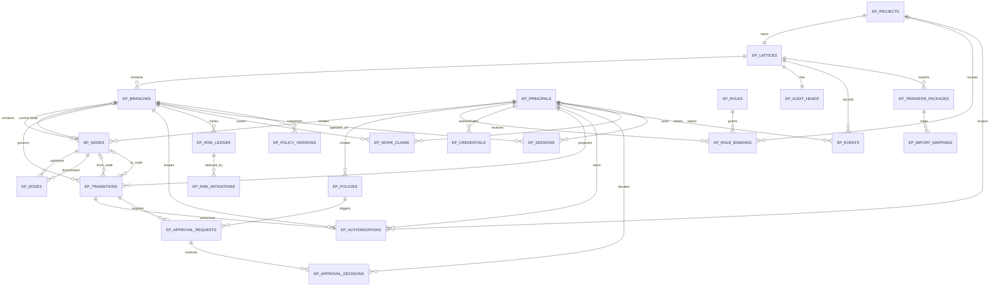
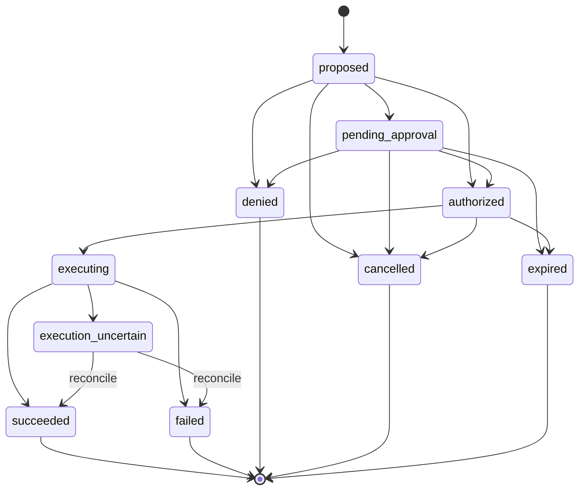
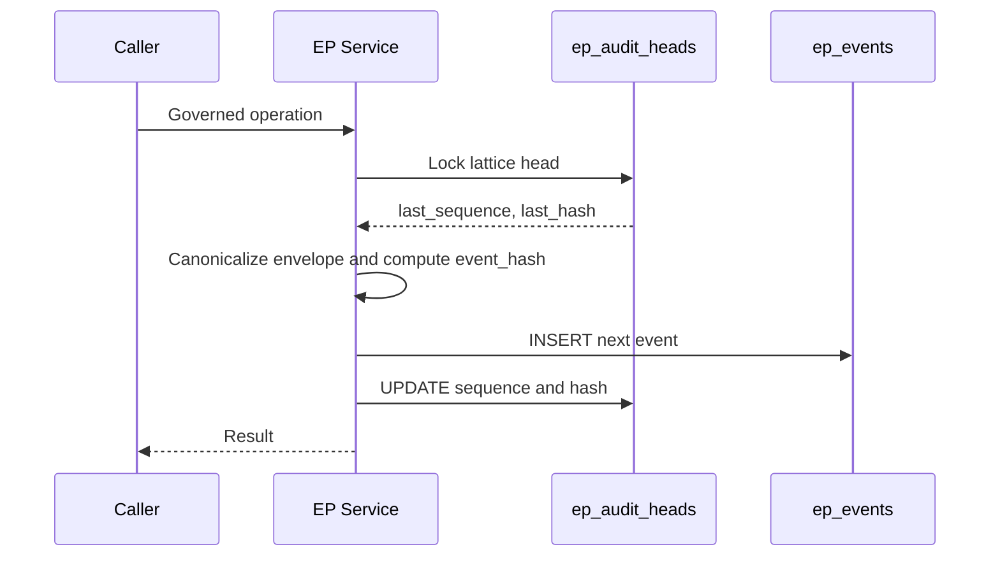

# EP-Governance Database Schema Reference

**Status:** Draft reference generated from the PostgreSQL and SQLite migration history and reviewed implementation notes.  
**Primary source of truth:** `migrations/postgres/001_init.sql`, later migration amendments, and `src/ep_governance/db/repositories.py`.  
**Database:** PostgreSQL 17 for production; SQLite for development and most tests.

> This document explains the logical model, relationships, constraints, access boundaries, and migration behavior. The SQL migrations remain authoritative if this reference and the executable schema ever differ.

---

## 1. Design goals

The database is designed to provide:

- persistent governance state for AI-agent actions;
- a directed project/lattice/branch/node graph;
- policy evaluation and approval records;
- signed, single-use execution authorizations;
- transition lifecycle enforcement;
- append-only, hash-chained audit history;
- risk tracking and mitigation evidence;
- work claims, sessions, and transfer packages;
- separation between governance data and target-system credentials.

All primary identifiers are textual XIDs. Production timestamps use `TIMESTAMPTZ`. Structured fields use `JSONB`.

---

## 2. Logical database domains

| Domain | Purpose | Principal tables |
|---|---|---|
| Identity and access | Principals, roles, credentials, project-scoped permissions | `ep_principals`, `ep_roles`, `ep_role_bindings`, `ep_credentials` |
| Core graph | Projects, lattices, branches, graph nodes, and edges | `ep_projects`, `ep_lattices`, `ep_branches`, `ep_nodes`, `ep_edges` |
| Governance policy | Policy definitions, lifecycle, scope, versions | `ep_policies`, `ep_policy_versions` |
| Action lifecycle | Proposed actions and their state transitions | `ep_transitions` |
| Authorization | Signed, expiring, single-use execution grants | `ep_authorizations` |
| Approval | Human or policy-approver review records | `ep_approval_requests`, `ep_approval_decisions` |
| Risk | Risk ledger entries and evidence-backed mitigations | `ep_risk_ledger`, `ep_risk_mitigations` |
| Audit | Per-lattice audit heads and immutable events | `ep_audit_heads`, `ep_events` |
| Operations | Work claims and execution sessions | `ep_work_claims`, `ep_sessions` |
| Portability | Export/import packages and identity mappings | `ep_transfer_packages`, `ep_import_mappings` |

---

## 3. Entity-relationship diagram



---

## 4. Core graph tables

### `ep_projects`

Top-level governed project.

| Column | Type | Rules |
|---|---|---|
| `id` | `TEXT` | Primary key |
| `name` | `TEXT` | Required |
| `description` | `TEXT` | Optional |
| `status` | `TEXT` | `active`, `completed`, or `archived` |
| `created_at` | `TIMESTAMPTZ` | Defaults to current time |

### `ep_lattices`

One governance lattice per project in the initial schema.

| Column | Type | Rules |
|---|---|---|
| `id` | `TEXT` | Primary key |
| `project_id` | `TEXT` | FK → `ep_projects.id`; required and unique |
| `name` | `TEXT` | Required |
| `created_at` | `TIMESTAMPTZ` | Defaults to current time |

### `ep_branches`

Mutable branch pointer and optimistic-concurrency boundary.

| Column | Type | Rules |
|---|---|---|
| `id` | `TEXT` | Primary key |
| `lattice_id` | `TEXT` | FK → `ep_lattices.id` |
| `name` | `TEXT` | Required |
| `head_node_id` | `TEXT` | FK → `ep_nodes.id` in PostgreSQL |
| `version` | `INTEGER` | Optimistic concurrency counter |
| `status` | `TEXT` | `active`, `merged`, or `abandoned` |
| `created_at` | `TIMESTAMPTZ` | Defaults to current time |

The branch-to-head relationship is circular with `ep_nodes`. PostgreSQL adds the foreign key after both tables exist. SQLite relies on application-level enforcement for this reference.

### `ep_nodes`

Committed graph states.

| Column | Type | Rules |
|---|---|---|
| `id` | `TEXT` | Primary key |
| `branch_id` | `TEXT` | FK → `ep_branches.id` |
| `agent_id` | `TEXT` | FK → `ep_principals.id` |
| `description` | `TEXT` | Optional |
| `bt_planning_budget` | `FLOAT` | Must be non-negative |
| `metadata` | `JSONB` | Defaults to `{}` |
| `status` | `TEXT` | `committed`, `quarantined`, `at_risk`, `superseded`, or `archived` |
| `created_at` | `TIMESTAMPTZ` | Creation time |
| `committed_at` | `TIMESTAMPTZ` | Commit time |

### `ep_edges`

Directed relationships between nodes.

| Column | Type | Rules |
|---|---|---|
| `id` | `TEXT` | Primary key |
| `upstream_node_id` | `TEXT` | FK → `ep_nodes.id` |
| `downstream_node_id` | `TEXT` | FK → `ep_nodes.id` |
| `edge_type` | `TEXT` | `dependency`, `establishes`, `requires`, or `conflicts_with` |
| `weight` | `FLOAT` | Defaults to `1.0` |
| `created_at` | `TIMESTAMPTZ` | Defaults to current time |

A check constraint prevents self-edges. Indexes support upstream and downstream traversal.

---

## 5. Identity and access tables

### `ep_principals`

Registry of humans, agents, services, and proxies.

| Column | Type | Rules |
|---|---|---|
| `id` | `TEXT` | Primary key |
| `name` | `TEXT` | Required |
| `type` | `TEXT` | `human`, `agent`, `service`, or `proxy` |
| `machine` | `TEXT` | Optional host association |
| `description` | `TEXT` | Optional |
| `status` | `TEXT` | `active`, `suspended`, or `revoked` |
| `registered_at` / `created_at` | timestamp | See current migration; both names appeared during schema alignment |

### `ep_roles`

Named permission bundles.

| Column | Type | Rules |
|---|---|---|
| `id` | `TEXT` | Primary key |
| `name` | `TEXT` | Required |
| `permissions` | `JSONB` | Permission list |

### `ep_role_bindings`

Binds a principal to a role, optionally within a project.

| Column | Type | Rules |
|---|---|---|
| `id` | `TEXT` | Primary key |
| `principal_id` | `TEXT` | FK → `ep_principals.id` |
| `role_id` | `TEXT` | FK → `ep_roles.id` |
| `project_id` | `TEXT` | Optional FK → `ep_projects.id`; null means global |
| `bound_at` | `TIMESTAMPTZ` | Binding time |

Role revocation is represented by removing the binding in the reviewed schema.

### `ep_credentials`

Stores hashes or certificate identity data, not plaintext secrets.

| Column | Type | Rules |
|---|---|---|
| `id` | `TEXT` | Primary key |
| `principal_id` | `TEXT` | FK → `ep_principals.id` |
| `credential_type` | `TEXT` | `api_key`, `enrollment_token`, or `tls_cert` |
| `credential_hash` | `TEXT` | Required |
| `expires_at` | `TIMESTAMPTZ` | Optional |
| `created_at` | `TIMESTAMPTZ` | Defaults to current time |

---

## 6. Policies and versions

### `ep_policies`

Versioned governance policy definitions.

Important fields include:

- creator, approver, and optional agent scope;
- effect: `deny`, `require_approval`, `warn`, or `allow`;
- action/resource match arrays and conditions;
- priority;
- lifecycle status;
- supersession and version metadata;
- validity window;
- exception relationships;
- origin and trust status.

PostgreSQL uses a GIN index on `actions` and a composite index on policy status/scope.

### `ep_policy_versions`

Records policy-set snapshots associated with a branch.

| Column | Type | Rules |
|---|---|---|
| `id` | `TEXT` | Primary key |
| `version` | `INTEGER` | Version number |
| `branch_id` | `TEXT` | FK → `ep_branches.id` |
| `policy_count` | `INTEGER` | Defaults to zero |
| `created_at` | `TIMESTAMPTZ` | Defaults to current time |

---

## 7. Transition lifecycle

### `ep_transitions`

Central record for every governed action.

Key relationships:

- proposing `agent_id`;
- target `branch_id`;
- optional `from_node_id` and `to_node_id`;
- optional executor principal;
- linked authorization and approval records.

Important field groups:

| Group | Representative fields |
|---|---|
| Request | `tool`, `action`, `resource`, `arguments`, `payload`, `payload_hash` |
| Evaluation | `classification`, `risk_assessments`, `verification_result`, `pulse_trace`, `matched_policies` |
| Policy binding | `policy_set_hash`, `matched_policy_versions` |
| Lifecycle | `stage`, `created_at`, `updated_at` |
| Concurrency | `expected_head_id`, `expected_version`, `idempotency_key` |
| Execution | `executor_id`, `execution_started_at`, `execution_completed_at`, `execution_attempt_id` |
| Result | `exit_status`, `result_summary`, `requires_manual_reconciliation` |
| Planning budget | `bt_planning_budget_before`, `bt_planning_budget_after` |

Valid stages:

```text
proposed
pending_approval
authorized
executing
succeeded
failed
execution_uncertain
cancelled
expired
denied
```

Important indexes:

- unique `idempotency_key`;
- agent and creation-time lookup;
- branch and creation-time lookup.

### Transition state diagram



---

## 8. Authorization and approval tables

### `ep_authorizations`

Signed, scoped, expiring, single-use grant to a proxy.

Key fields include:

- transition, agent, project, and branch references;
- `token_hash` and `payload_hash`;
- `policy_set_hash` and matched policy versions;
- proxy audience and tool;
- nonce;
- issued/expiry/used timestamps;
- `execution_attempt_id`.

The single-use claim path must atomically change `used` from false to true. The token and transition are bound to the actual payload hash.

### `ep_approval_requests`

One request for review of a transition under a policy.

Lifecycle values: `pending`, `approved`, `denied`, `expired`.

### `ep_approval_decisions`

Append-style decision records tied to an approval request, including reviewer, decision, reason, and time.

---

## 9. Risk tables

### `ep_risk_ledger`

Branch-scoped risk entries covering domains such as:

- production database;
- external communications;
- deployment;
- data privacy;
- security.

Stores inherent risk, residual risk, required approval level, acceptance identity, and expiration.

### `ep_risk_mitigations`

Evidence-backed reductions applied to a risk-ledger entry.

Includes mitigation type, credit, evidence, evidence URI/hash, verifier, verification time, expiration, scope, and application time.

---

## 10. Audit tables

### `ep_audit_heads`

One mutable hash-chain head per lattice.

| Column | Purpose |
|---|---|
| `lattice_id` | PK and FK → `ep_lattices.id` |
| `last_sequence` | Last committed event sequence |
| `last_hash` | Hash of the last event |

Only the governance service should update this table.

### `ep_events`

Append-only, per-lattice event log.

Important fields:

- lattice and sequence;
- event type and canonical event data;
- previous hash and event hash;
- actor principal;
- authenticated caller;
- event writer;
- creation time.

Expected constraints include uniqueness of `(lattice_id, sequence)`. Database roles deny ordinary update/delete access; the audit verifier recomputes the chain.

### Audit-chain sequence



---

## 11. Operational and transfer tables

### `ep_work_claims`

Tracks agent claims over a branch region, including claim status and timing.

### `ep_sessions`

Tracks agent sessions on branches, model information, start time, and session status/end time.

### `ep_transfer_packages`

Contains portable lattice snapshots, schema/package versions, source identity, serialized lattice state, model information, and creation time.

### `ep_import_mappings`

Maps source entity IDs to imported entity IDs for a transfer package.

---

## 12. Access model

| Component | Governance DB | Target DB | Expected permissions |
|---|---:|---:|---|
| Agent | No direct access | No direct access | Communicates through authenticated EP interface |
| EP service | Yes | No | Read/write governance state; issue authorizations; append audit |
| Governed proxy | Yes, narrowly scoped | Yes, narrowly scoped | Claim authorization, update execution lifecycle, execute approved target action |
| Human operator | Via managed tooling | Normally no | Migration, backup, recovery, controlled administration |
| Read-only auditor | Read-only | No | Policies, transitions, events, and verification data |

Production roles should deny direct mutation of audit events and should not grant target-database credentials to agents or the EP service.

---

## 13. PostgreSQL and SQLite differences

| Area | PostgreSQL | SQLite |
|---|---|---|
| Structured fields | `JSONB` | JSON encoded as `TEXT` |
| Timestamps | `TIMESTAMPTZ` | ISO-8601 text |
| Concurrency | Row/advisory locks and real parallelism | Serialized writes |
| Branch-head FK | Enforced after table creation | Application-enforced in initial migration |
| Audit sequencing | Lock-based per-lattice serialization | Serialized transaction behavior |
| Production status | Supported | Development/test only |

SQLite should not be treated as proof of PostgreSQL concurrency behavior.

---

## 14. Migration order

The initial PostgreSQL migration creates objects in dependency order:

```text
principals
projects
lattices
branches
nodes
edges
policies
roles
role_bindings
credentials
transitions
authorizations
approval_requests
approval_decisions
risk_ledger
risk_mitigations
audit_heads
events
work_claims
sessions
transfer_packages
import_mappings
policy_versions
```

The circular branch-head foreign key is added after `ep_nodes` is created.

Role and grant migrations must run after schema creation. Production deployments should record the exact migration file hashes applied to each environment.

---

## 15. Critical invariants

1. An authorization is bound to one transition and one payload hash.
2. An authorization can be claimed only once.
3. A transition cannot skip illegal lifecycle states.
4. Branch advancement uses expected head and version checks.
5. Audit sequence numbers are unique per lattice.
6. Audit-event hashes form a verifiable chain.
7. Agents have no direct governance or target-database credentials.
8. Audit events are append-only through database privileges.
9. Cancellation requires the originating authenticated principal or an authorized administrator.
10. Policy-set changes invalidate stale authorizations before execution.

---

## 16. Recommended schema-verification query

```sql
SELECT
    table_name
FROM information_schema.tables
WHERE table_schema = 'ep_governance'
  AND table_type = 'BASE TABLE'
ORDER BY table_name;
```

Foreign keys:

```sql
SELECT
    tc.table_name,
    kcu.column_name,
    ccu.table_name AS referenced_table,
    ccu.column_name AS referenced_column
FROM information_schema.table_constraints tc
JOIN information_schema.key_column_usage kcu
  ON tc.constraint_name = kcu.constraint_name
 AND tc.table_schema = kcu.table_schema
JOIN information_schema.constraint_column_usage ccu
  ON ccu.constraint_name = tc.constraint_name
 AND ccu.table_schema = tc.table_schema
WHERE tc.constraint_type = 'FOREIGN KEY'
  AND tc.table_schema = 'ep_governance'
ORDER BY tc.table_name, kcu.column_name;
```

Indexes:

```sql
SELECT
    tablename,
    indexname,
    indexdef
FROM pg_indexes
WHERE schemaname = 'ep_governance'
ORDER BY tablename, indexname;
```

---

## 17. Maintenance rule

Whenever a migration changes the schema:

1. update this document in the same pull request;
2. update the Mermaid ER diagram;
3. update the table inventory and constraints;
4. run migration tests on SQLite and PostgreSQL;
5. verify a clean migration and a migration round trip;
6. record the tested commit and PostgreSQL version.
